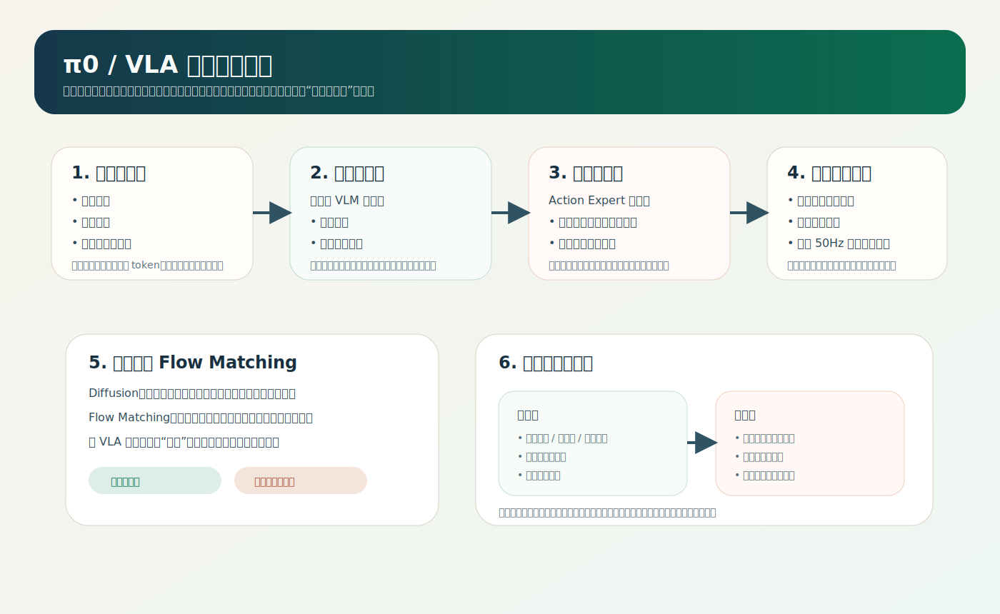

# π0 架构拆解

## 背景与目标

`π0` 的架构价值在于，它没有把“理解语言”和“输出机器人动作”硬塞进同一个头部，而是把连续控制从通用语义理解里拆出来，形成一套更接近真实机器人系统约束的结构。

### 本文关注三件事

- `VLM` 和 `Action Expert` 的职责如何切分。
- 为什么连续控制不能直接用文本 token 范式解决。
- 这套结构对后续 VLA 系统设计有什么启发。

### 典型适用场景

- 语言指令驱动的机器人操作任务。
- 多机器人共享语义能力，但动作接口不同的系统。
- 需要保持较高控制频率的 manipulation 任务。

## 关键问题

| 维度 | 核心问题 | 典型设计抓手 |
|---|---|---|
| 表征 | 语义条件如何进入控制链路 | 预训练 `VLM` 输出高层语义条件 |
| 动力学 / 机制 | 连续动作如何建模 | `Action Expert` 学习动作更新方向 |
| 决策 / 输出 | 如何避免直接从文本头回归动作 | 单独的动作专家与速度场建模 |
| 泛化 | 多机器人如何共享知识 | 共享语义层，分离控制层 |
| 部署 | 如何满足高频控制 | 缩短动作生成路径，减少推理延迟 |

## 技术地图

## 方法拆解

### 一条典型技术链路

1. 图像和语言先进入 `VLM`，形成任务语义理解。
2. 机器人状态与带噪动作进入 `Action Expert`。
3. 动作专家在语义条件下输出速度场。
4. 速度场逐步积分成最终可执行动作。
5. 控制器把动作序列下发到机器人执行。

### 常见结构模块

- 语义编码：视觉 + 语言。
- 状态输入：关节状态、当前动作噪声。
- 动作专家：独立于 `VLM` 的连续控制模块。
- 输出层：速度方向或动作修正量。
- 执行层：机器人控制回路。

### 工程上最难的三点

- 离散 token 和连续控制信号天然不兼容。
- 不同机器人自由度不同，统一输出接口并不自然。
- 语义理解强不代表动作控制稳定。

## 当前判断

- `π0` 的结构更像“通用语义脑 + 专用动作手”，而不是一个单体大模型。
- 这种分层设计很可能会持续出现在后续具身智能系统里。

## 参考与署名

- 来源类型：Bilibili / 论文 / 项目页 / 调研整理
- 视频或文档链接：https://www.bilibili.com/video/BV1SEdWBXEqj/
- 标题：【π系列 EP01】π0：让一个模型控制所有机器人？Flow Matching + VLM 架构详解
- 作者 / UP 主 / 团队：enjoy_2333 / Physical Intelligence
- 发布时间：2026-04-18
- 说明：本页基于视频截图与官方公开资料整理。
