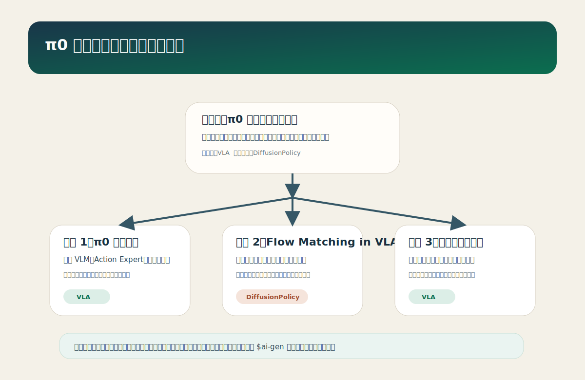

# π0 技术路线专题总览

<callout emoji="brain" background-color="light-blue">

这是一份面向研究与工程落地的 `π0 / VLA / Flow Matching` 技术梳理。它基于 Bilibili 视频讲解、章节截图、`Physical Intelligence` 官方博客与论文公开资料整理，目标不是复述视频，而是把内容沉淀成后续可继续拆分、补图和推送到飞书知识库的专题页。
</callout>

## 背景与目标

`π0` 代表的是一条很具体的具身智能路线：不是让通用语言模型直接回归动作，而是把视觉语言理解、连续动作生成、训练策略和实时控制约束拆开处理，再把它们拼成一个可扩展的 VLA 系统。这条路线值得整理，是因为它同时回应了三个常见问题：

- 为什么机器人控制问题不能直接沿用语言模型范式。
- 为什么 `Flow Matching` 会在 VLA 场景里替代一部分扩散式动作生成方案。
- 为什么大规模预训练与任务级后训练必须并存，而不能只押注某一个阶段。

### 本文关注三件事

- 定义边界：`π0` 与 `OpenVLA`、`Octo`、`Diffusion Policy` 的主要区别是什么。
- 技术抓手：`VLM + Action Expert + Flow Matching + 两阶段训练` 分别解决什么问题。
- 工程落地：控制频率、推理延迟、数据规模、后训练成本如何一起约束系统设计。

### 典型适用场景

- 需要机器人在语言指令条件下执行连续操作任务。
- 需要在多机器人、多任务数据上预训练，再面向具体任务快速精调。
- 需要在实时控制约束下，兼顾语义理解能力和动作生成质量。

## 关键问题

| 维度 | 核心问题 | 典型设计抓手 |
|---|---|---|
| 表征 | 如何把语言、视觉和机器人状态放到一个统一决策框架里 | 预训练 `VLM` 负责语义表征，关节状态单独接入动作头 |
| 动力学 / 机制 | 如何生成连续、稳定、可实时执行的动作序列 | `Action Expert + Flow Matching` 学习速度场 |
| 决策 / 输出 | 如何把高层语义理解变成 50Hz 级控制信号 | 独立动作专家输出连续动作更新方向 |
| 泛化 | 如何跨机器人、跨任务迁移 | 大规模异构预训练 + 少量任务级后训练 |
| 部署 | 如何满足实时性、稳定性与安全性 | 减少推理步数、缩短控制延迟、保留失败恢复能力 |

## 技术地图

## 方法拆解

### 一条典型技术链路

1. 用预训练 `VLM` 读取视觉观测和语言指令，建立任务语义。
2. 把机器人关节状态、带噪动作与语义条件一起送入 `Action Expert`。
3. 用 `Flow Matching` 预测动作更新的速度场，而不是逐步反向去噪。
4. 在预训练阶段学习跨任务、跨 embodiment 的通用操作基础。
5. 在后训练阶段用少量高质量任务数据把某类技能打磨到可用水平。

### 常见结构模块

- 观测 / 输入编码：图像、文本指令、机器人状态。
- 核心建模：预训练 `VLM` 负责语义理解，动作专家负责控制建模。
- 输出解码：连续动作或速度更新方向。
- 训练策略：大规模异构预训练，少量高质量后训练。
- 推理优化：使用 `Flow Matching` 减少推理步数，压缩控制延迟。

### 工程上最难的三点

- 离散语言表征和连续控制信号之间天然不匹配。
- 动作生成模型如果推理太慢，就无法进入高频闭环控制。
- 只做泛化预训练或只做任务精调都会在真实系统里暴露短板。

## 对比维度

| 范式 / 方法 | 条件输入 | 输出对象 | 优势 | 局限 |
|---|---|---|---|---|
| `π0` | 图像 + 语言 + 机器人状态 | 连续动作速度场 | 兼顾语义理解和实时连续控制 | 仍依赖高质量动作数据与后训练 |
| `OpenVLA / Octo` | 图像 + 语言 | 动作 token / policy 输出 | 统一性强，便于做通用 VLA 基座 | 控制细粒度与实时性约束更紧 |
| `Diffusion Policy` | 状态 / 图像 + 任务条件 | 扩散式动作序列 | 动作质量高，行为分布建模强 | 推理步数多，实时控制更吃紧 |

## 仓库 / 论文调研

> 调研时间：2026-05-17。这里保留本次视频强相关的官方资料，并补上后续值得继续跟的工程入口。

| 仓库 / 论文 | 定位 | 开源亮点 / 核心贡献 | 适合关注的原因 |
|---|---|---|---|
| `π0: A Vision-Language-Action Flow Model for General Robot Control` | `π0` 主论文 | 把 `VLM` 与 `Flow Matching` 动作专家结合到通用机器人控制里 | 是理解整条路线的第一手资料 |
| `Physical Intelligence / openpi` | 官方工程入口 | 给出 `π0` 相关实现和后续演化路线 | 便于继续追踪 `π0-FAST`、`π0.5` 等后续版本 |
| `Diffusion Policy` | 对照路线 | 典型的扩散式动作生成方法 | 用来理解为什么 `Flow Matching` 会成为本视频反复对比的对象 |

### 建议优先阅读顺序

1. 先读 `π0` 官方博客，建立整体结构印象。
2. 再读 `π0` 论文，重点看 `Action Expert`、训练范式和实验段落。
3. 最后回头对照 `Diffusion Policy` 与 `OpenVLA`，理解路线差异。

### 当前判断

- `π0` 的真正价值不只是模型名字，而是它把“语义理解”和“连续控制”分拆成两类不同问题来处理。
- `Flow Matching` 是否会成为新一代 VLA 动作头常用范式，取决于它在更长时程、更复杂 embodiment 上是否还能维持速度和稳定性。

## 待补充材料

- 时间线：`π0 -> π0-FAST -> π0.5 -> π0.6` 的版本迭代。
- 数据与 benchmark：跨机器人数据规模、任务分布、后训练样本量。
- 实现对比：`π0` 与 `OpenVLA`、`Octo`、`GR00T` 在输出形式上的差异。
- 工程约束：部署延迟、控制频率、恢复能力与安全边界。
- 复现路线：本地环境、数据采集、训练与推理链路。

## 可继续拆分的子专题

- [π0 架构拆解](topics/pi0-architecture.md)
- [Flow Matching 在 VLA 中的作用](topics/flow-matching-in-vla.md)
- [具身智能两阶段训练范式](topics/embodied-training-paradigm.md)

## 参考与署名

- 来源类型：Bilibili / 论文 / 项目页 / 调研整理
- 视频或文档链接：https://www.bilibili.com/video/BV1SEdWBXEqj/
- 标题：【π系列 EP01】π0：让一个模型控制所有机器人？Flow Matching + VLM 架构详解
- 作者 / UP 主 / 团队：enjoy_2333 / Physical Intelligence
- 发布时间：2026-04-18
- 论文：https://arxiv.org/abs/2410.24164
- 官方博客：https://www.pi.website/blog/pi0
- 开源项目：https://www.pi.website/blog/openpi
- 说明：本页基于视频简介、章节截图、官方博客与论文公开资料整理；当前未获取 Bilibili 官方字幕。
